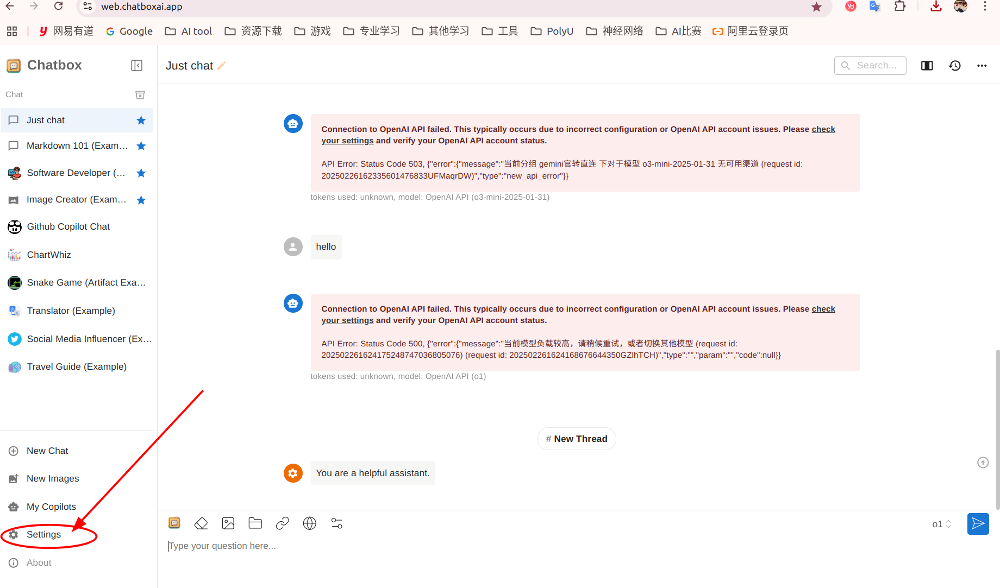
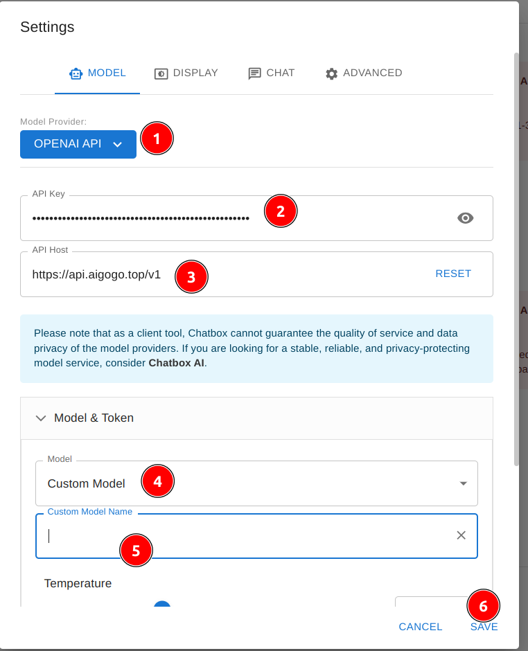
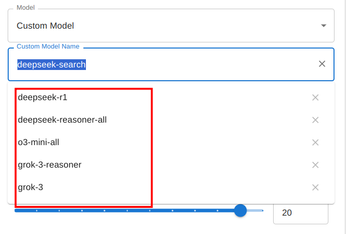
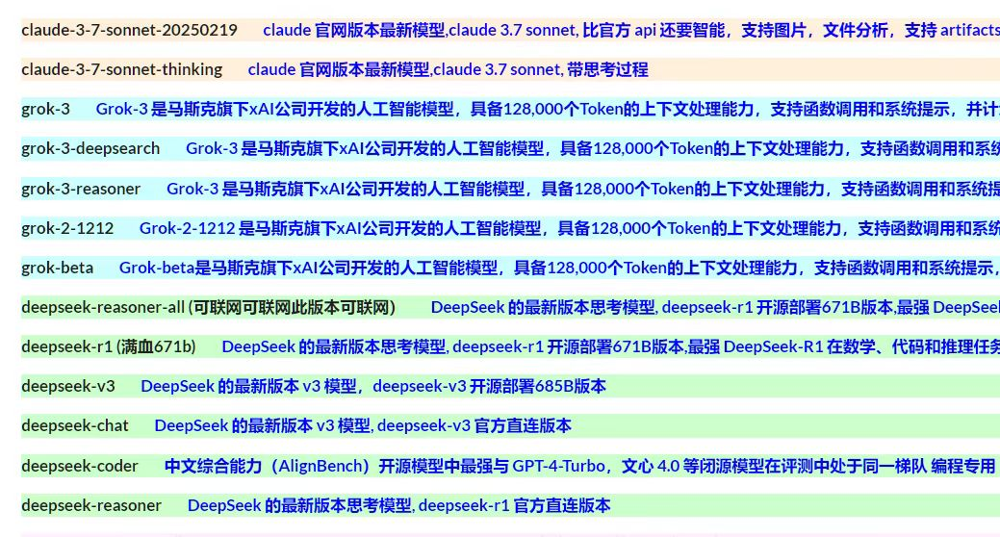
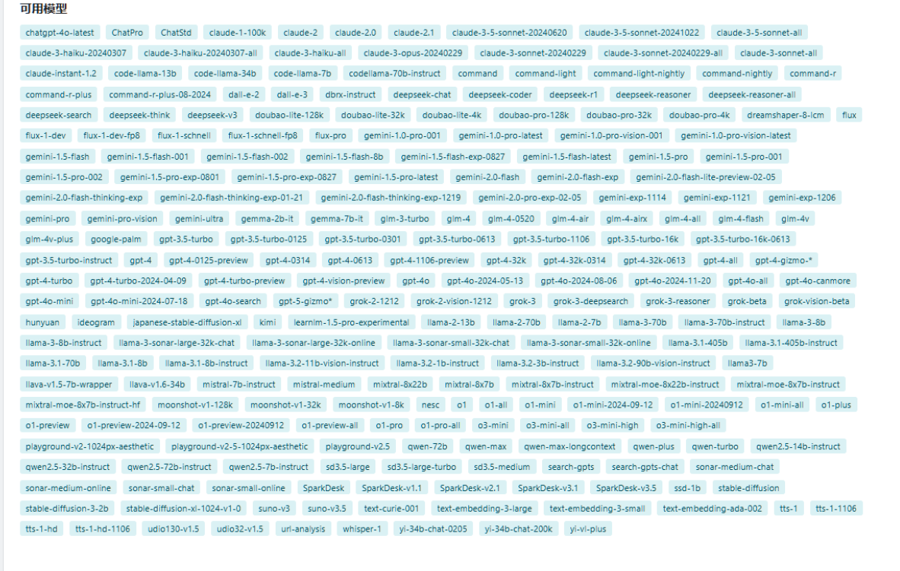

用chatbox工具（支持安卓，windows,ios,web），再接入定制化的api和密码（我提供，不值钱）

# web

https://web.chatboxai.app/ 打开网站，或者搜索`chatbox`，下载app

1. 点击`设置`



2. `Model Provider`选择`OPENAI API`
3. 输入`API Key`就是密码，输入`API Host:` `https://api.aigogo.top/v1`





4. `Model`选择`Custom Model`（在最下面），以下是所有可以用的model

```
# 推荐的Model
deepseek-r1
deepseek-reasoner-all # 有联网，r1模型
o3-mini-all # 有联网
grok-3
grok-3-reasoner # 有联网

# 其他模型有没有联网功能我还没测试
# 测试方法： 问ai,你有联网功能吗？
# 测试模型版本： 问ai,你是什么版本？
```



