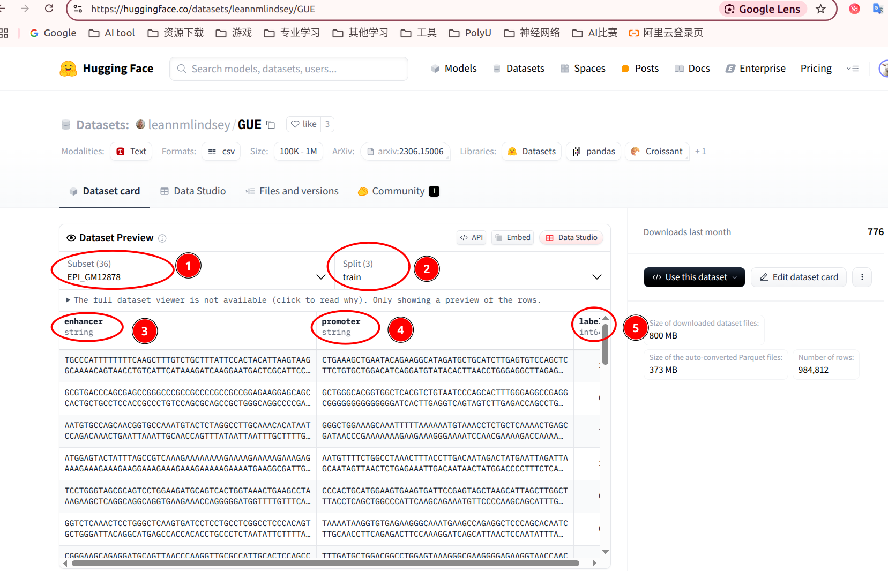

数据集展示

## GUE

[README](https://huggingface.co/datasets/leannmlindsey/GUE/blob/main/README.md)

出自论文[DNABERT-2: Efficient Foundation Model and Benchmark For Multi-Species Genome](https://arxiv.org/pdf/2306.15006)

数据链接[data](https://huggingface.co/datasets/leannmlindsey/GUE)

如上图，这整个网页是论文中用到的所有数据集的大集合

**1**是选择数据集名字

**2**是`train->训练集，test->测试集，dev->验证集`，作者预先划分好的，为了确保不同使用者可以用相同规则进行benchmark测试

**345**是数据表的`属性 attribute`，`label`是预测的目标，其他作为输入

hugging face的数据库都是一样的格式

## NT

https://huggingface.co/datasets/InstaDeepAI/nucleotide_transformer_downstream_tasks

AIDO.DNA 用了enhancer 和 promoter_all数据集

## ??

https://www.biorxiv.org/content/10.1101/2024.07.27.605418v1

dependency mapping 任务

我没搞懂数据在哪

> Dependency mapping is an *in silico* mutagenesis technique that identifies co-conserved elements in a sequence. AIDO.ModelGenerator implements the procedure proposed by [Tomaz da Silva et al.](https://www.biorxiv.org/content/10.1101/2024.07.27.605418v1) We use this to mine functional genomic elements in the [AIDO.DNA](https://doi.org/10.1101/2024.12.01.625444) paper with the [AIDO.DNA-7B](https://huggingface.co/genbio-ai/AIDO.DNA-7B) and [AIDO.DNA-300M](https://huggingface.co/genbio-ai/AIDO.DNA-300M) models. This task uses the pre-trained models directly, and does not require finetuning.

## ??

使用的data <https://hgdownload.soe.ucsc.edu/gbdb/hg38/bbi/clinvar/>

选取自data网站 <https://hgdownload.soe.ucsc.edu/downloads.html>

> Zeroshot variant effect prediction refers to the task of predicting the functional impact of genetic variants, especially single nucleotide polymorphisms (SNPs), without requiring additional task-specific fine-tuning of the model. AIDO.ModelGenerator implements the procedure proposed by [Nucleotide Transformer](https://www.biorxiv.org/content/10.1101/2023.01.11.523679v1) We use this to predict the effects of single nucleotide polymorphisms (SNPs) in the [AIDO.DNA-300M](https://huggingface.co/genbio-ai/AIDO.DNA-300M) model. This task uses the pre-trained models directly, and does not require finetuning.