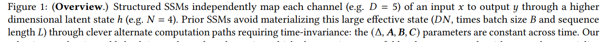
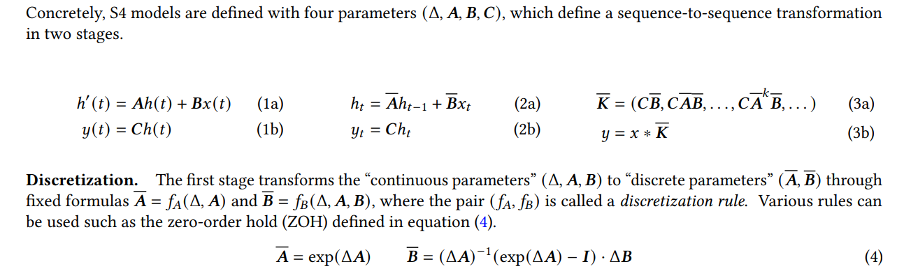
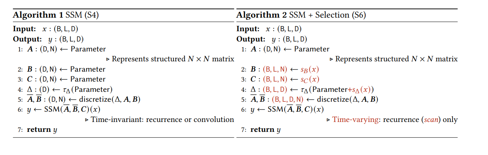
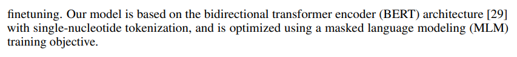
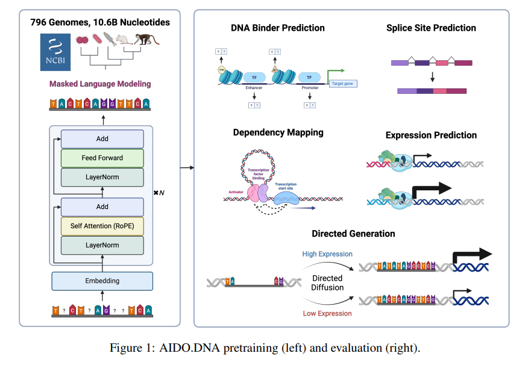

# mamba

original papers: [Mamba: Linear-Time Sequence Modeling with Selective State Spaces](https://arxiv.org/pdf/2312.00752)

SSM:

# applications

[Caduceus: Bi-Directional Equivariant Long-Range DNA Sequence Modeling](https://consensus.app/papers/caduceus-bidirectional-equivariant-longrange-dna-schiff-kao/4991b0258a8f56f2b2752e2bc4fe4db9/)

----------------------------------------

[Accurate and General DNA Representations Emerge from Genome Foundation Models at Scale](https://www.biorxiv.org/content/biorxiv/early/2024/12/05/2024.12.01.625444.full.pdf)

# others

https://paperswithcode.com/paper/kimi-k1-5-scaling-reinforcement-learning-with

https://paperswithcode.com/paper/long-vita-scaling-large-multi-modal-models-to

https://paperswithcode.com/paper/moba-mixture-of-block-attention-for-long

https://paperswithcode.com/paper/scaling-up-test-time-compute-with-latent

# 分工

模型下载

数据集分析

下游任务尝试

结合数据集进行benchmark

模型预训练使用的数据集， 下游任务数据集， 需要匹配

