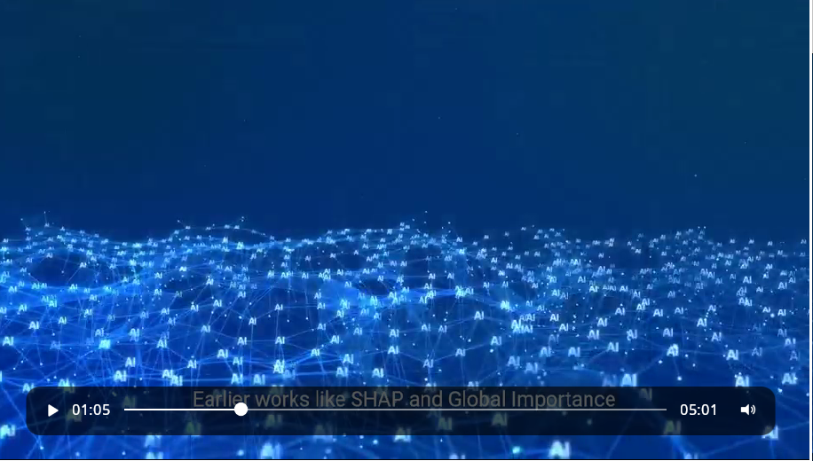
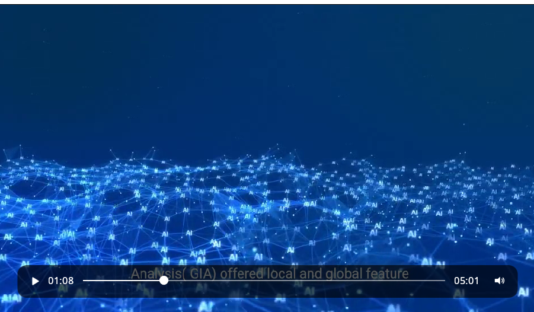
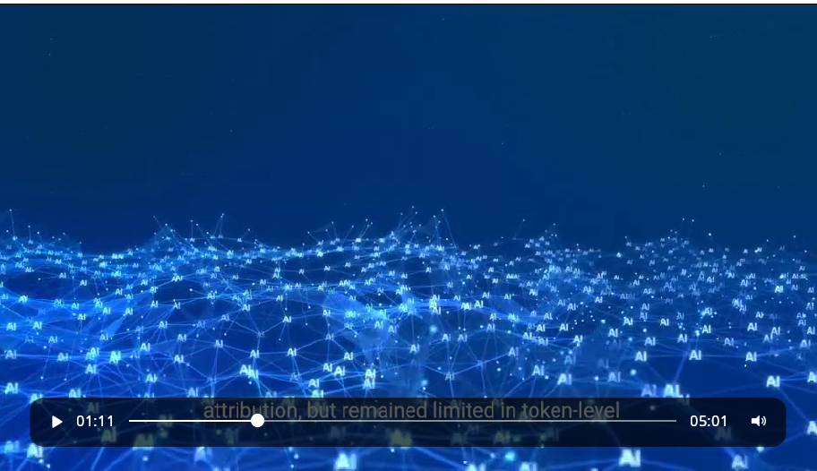
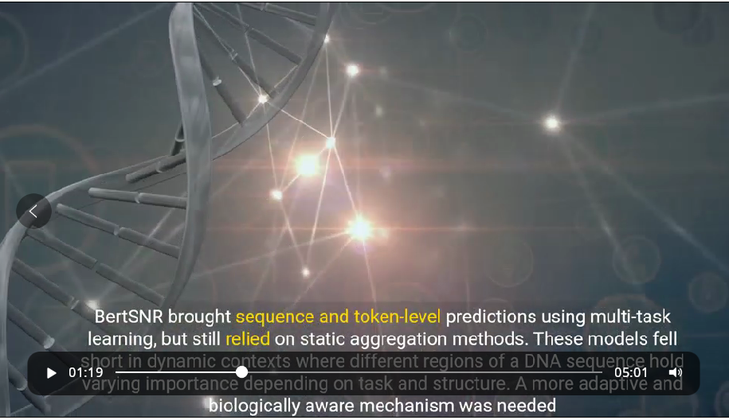
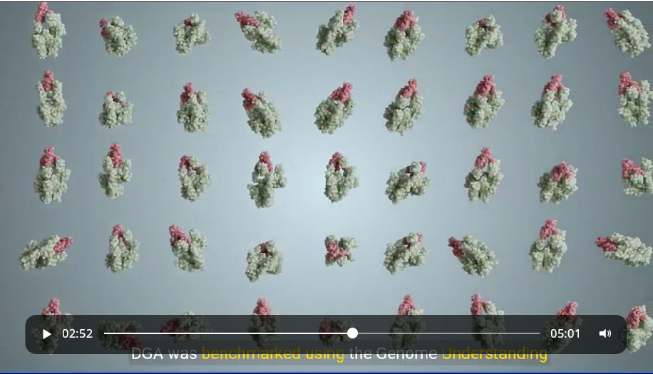
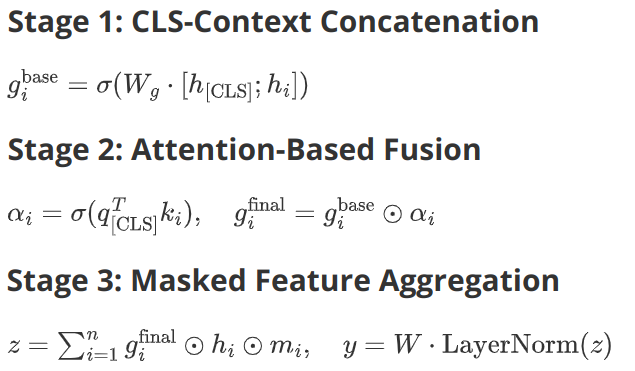
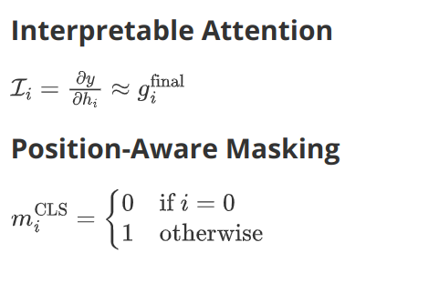

## 1

上面这几个关于early work 删掉，都是连续的slice(1:05--1:40)

## 2

修改下面时间段的slice(1:40--2:50),一直到下面这个slice（这个slice保留），（2:50往后的slice就交给凡哥审核了。

-------------------

修改后的内容(图加文字）：

### slice 1

We propose a 3-step model to dynamically rank token importance:

1. **CLS-Token Fusion**: Combine each token’s embedding with the CLS token (which captures the whole sequence). A sigmoid function assigns *initial importance scores* to all tokens.
2. **Attention Refinement**: Calculate *attention scores* by matching each token’s features with the CLS token’s features. Multiply these scores with the initial scores to emphasize tokens relevant to the CLS token.
3. **Final Aggregation**:
   - Weight tokens using the refined scores and sum them, ignoring padding tokens via a mask.
   - Normalize the summed output (layer norm) and pass it through a linear layer for predictions.

### slice 2

The token importance mechanism uses two key features:  

1. Interpretable Attention: Final gating values approximate gradient-based importance scores, enabling efficient analysis of token influence. Actually, we need more ablation experiment to convince its effect. But since the cause of high gpu expenditure, we expect the future work will refine the comparison.  
2. Position-Aware Masking: A mask zeros out the CLS token’s contribution during aggregation, ensuring importance scores reflect only sequence tokens (not the CLS placeholder).  In our experiment without the mask, the token importance scores will close to 0 and CLS importance scores will close to 1.

## 3

不要BGM, 视频开始加一句话`本视频语音和部分画面由***AI生成`

