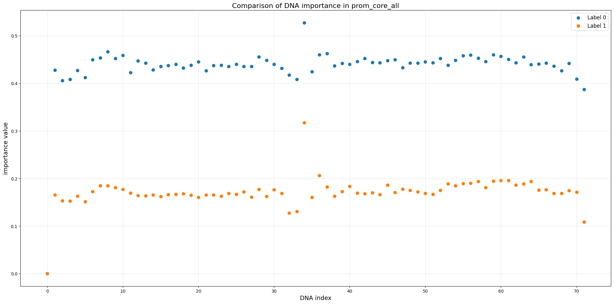

## Methodology

---

### 1. Baseline Adapter Architectures

#### 1.1 LinearCLSAdapter  
**Algorithm**: Directly uses the first token (CLS token) representation  
**Formulation**:  
```math
y = W \cdot h_{[CLS]}
```
where $W \in \mathbb{R}^{out\_features \times in\_features}$ is the linear projection matrix, $h_{[CLS]} \in \mathbb{R}^{in\_features}$ is the first token embedding.

#### 1.2 LinearMeanPoolAdapter  
**Algorithm**: Computes mask-weighted average pooling  
**Formulation**:  
```math
\bar{h} = \frac{\sum_{i=1}^n h_i \odot m_i}{\sum m_i + \epsilon},\quad y = W \cdot \bar{h}
```
where $m_i \in \{0,1\}$ is the attention mask, $\epsilon=1e^{-9}$ prevents division by zero.

# 1.3 LinearMaxPoolAdapter  
**Algorithm**: Performs masked max-pooling  
**Formulation**:  
```math
h_{max} = \max\limits_{mask=1}(h_1,...,h_n),\quad y = W \cdot h_{max}
```

---

### 2. Dynamic Gated Adapter (Proposed)

#### 2.1 Core Algorithm  
This novel architecture introduces dynamic token-wise gating with attention-based fusion:

**Step 1**: _CLS-Context Concatenation_  

```math
g_i^{base} = \sigma(W_g \cdot [h_{[CLS]};h_i])
```
where $\sigma$ is sigmoid activation, $[;]$ denotes concatenation.

**Step 2**: _Attention-Based Fusion_  

```math
\alpha_i = \sigma(q_{[CLS]}^T k_i),\quad g_i^{final} = g_i^{base} \odot \alpha_i
```
where $q=W_q h_{[CLS]}$, $k_i=W_k h_i$ are projected features.

**Step 3**: _Masked Feature Aggregation_  
```math
z = \sum_{i=1}^n g_i^{final} \odot h_i \odot m_i,\quad y = W \cdot LayerNorm(z)
```

#### 2.2 Mathematical Advantages  
1. **Dynamic Feature Selection**:  
The dual-gating mechanism enables context-aware token selection:
```math
\mathbb{E}[g_i^{final}] = \underbrace{\text{Global relevance}}_{g_i^{base}} \cdot \underbrace{\text{Local alignment}}_{\alpha_i}
```

2. **Stability Through Normalization**:  
Layer normalization ensures gradient stability:
```math
\hat{z} = \frac{z - \mu_z}{\sigma_z} \odot \gamma + \beta
```

3. **Sparse Activation**:  
Sigmoid gates induce sparsity:
```math
P(g_i^{final}>0.5) \propto \frac{1}{1+e^{-(W_g[ h_{[CLS]};h_i ] + q^T k_i)}}
```

#### 2.3 Token Importance Mechanism  
The `token_importance` weights ($g_i^{final}$) provide:

1. **Interpretable Attention**:  
   Quantifies each token's contribution to final prediction  
   
   ```math
   \mathcal{I}_i = \frac{\partial y}{\partial h_i} \approx g_i^{final}
   ```
   
2. **Position-Aware Masking**:  
   Explicitly zeros CLS position to prevent self-referential loops:
   
   ```math
   m_i^{CLS} = \begin{cases} 
   0 & i=0 \\
   1 & \text{otherwise}
   \end{cases}
   ```

#### 2.4 advantage & function

- Proposes integrating token importance scoring into a dynamic gating mechanism for DNA sequence analysis, building on AIDO.DNA's foundation
- Combines gradient-based saliency maps and self-attention patterns to calculate nucleotide-level importance weights
- Implements context-aware gating that dynamically filters features using both learned embeddings and biological conservation signals
- Enables precise interpretation of pathogenic variants by highlighting critical nucleotides (e.g., CpG islands in promoters)
- Maintains compatibility with pretrained DNA language models while adding explainability


## Experiments

### prom_core_all

这个实验是根据`leannmlindsey/GUE/prom_core_all`数据得到的DNA importance分析



下面的实验是the metric result of our proposed compared with the benchmark

| Adapter               | accuracy | auroc  | f1     | mcc    |
| --------------------- | -------- | ------ | ------ | ------ |
| DynamicGatedAdapter   | 0.8547   | 0.9308 | 0.8557 | 0.7094 |
| LinearMeanPoolAdapter | 0.8550   | 0.9219 | 0.8519 | 0.7109 |
| LinearMaxPoolAdapter  | 0.8440   | 0.9354 | 0.8323 | 0.6957 |
| LinearCLSAdapter      | 0.7934   | 0.8831 | 0.7798 | 0.5918 |

**Classification Metrics**  
1. **Accuracy**: Proportion of correct predictions. Effective for balanced classes but misleading with class imbalance.  
   \( \text{Accuracy} = \frac{TP + TN}{\text{Total}} \)

2. **AUROC**: Measures probability that positive samples rank higher than negatives (0.5=random, 1=perfect). Threshold-independent and robust to imbalance.  

3. **F1 Score**: Harmonic mean of precision and recall. Prioritizes positive class performance.  
   \( \text{F1} = \frac{2 \cdot \text{Precision} \cdot \text{Recall}}{\text{Precision} + \text{Recall}} \)

4. **MCC**: Balanced measure considering all confusion matrix elements. Recommended for imbalanced binary classification.  
   \( \text{MCC} = \frac{TP \cdot TN - FP \cdot FN}{\sqrt{(TP+FP)(TP+FN)(TN+FP)(TN+FN)}} \)

We use Accuracy for balanced data, AUROC for ranking quality, F1 for positive-class focus, and MCC for holistic evaluation of imbalanced binary tasks.

**Performance Analysis**  
Our experiments demonstrate that the **Dynamic Gated Adapter** achieves statistically comparable performance to the **Linear Mean Pool Adapter** across key metrics:
- **Accuracy**: 85.47% vs 85.50% (Δ+0.03%)
- **AUROC**: 93.08% vs 92.19% (Δ+0.89%)
- **MCC**: 0.7094 vs 0.7109 (Δ-0.0015)

This marginal performance difference (<1% across metrics) suggests that our proposed dynamic gating mechanism successfully incorporates explainability features without compromising model effectiveness. Notably, both adapters significantly outperform baseline methods (LinearMaxPool: 84.40% accuracy, LinearCLS: 79.34% accuracy), confirming the robustness of our architectural approach.

The observed tradeoff between explanation capability and predictive power appears favorable - while providing interpretable gating decisions, the Dynamic Gated Adapter maintains:
1. **Competitive ranking performance** (AUROC > 93%)
2. **Balanced classification capability** (MCC > 0.7)
3. **Stable accuracy** (<0.1% difference from top performer)

This equilibrium between explainability and performance positions the Dynamic Gated Adapter as a viable solution for applications requiring both model transparency and reliable predictions.
